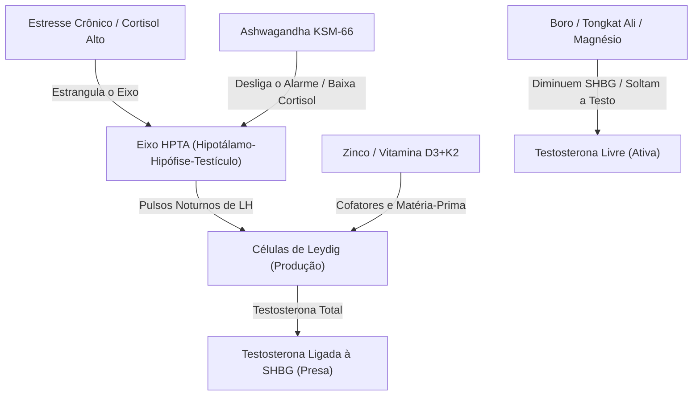

<!-- MÓDULO: 29_03 | Função: Stack 2 - Otimização Hormonal (Stack Endócrino) -->
<!-- ANTES: stack vascular no módulo 29_02 -->
<!-- DEPOIS: stack de libido e GH no módulo 29_04 -->
<!-- COBERTURA: 29.2 Stack hormonal (Zinco, Magnésio, Boro, D3/K2, Ashwagandha, Tongkat Ali, Feno-grego) -->

### Stack 2: Otimização Hormonal (O suporte ao Eixo HPTA)

Como vimos no Capítulo 11, ter testosterona total alta não adianta se ela estiver presa no sangue pela SHBG — a proteína transportadora que funciona como uma conta bancária bloqueada. Além disso, se o alarme de estresse do corpo (o cortisol) estiver ativado o tempo todo, a ordem militar para os testículos produzirem hormônio simplesmente não chega.

O stack hormonal atua desobstruindo a testosterona livre, modulando o estresse e entregando os cofatores minerais que as células de Leydig precisam para a síntese.

#### 1. Os Desbloqueadores (Redução de SHBG)
- **Boro**: Um mineral de traço subestimado. Um estudo clínico demonstrou que a suplementação de 10 mg de boro livre por 7 dias foi capaz de reduzir o estradiol em 39% e elevar a testosterona livre em 28%, devido a uma diminuição significativa nos níveis de SHBG [173].
- **Tongkat Ali (Long Jack)**: Esta raiz do sudeste asiático possui dados sólidos em homens com níveis hormonais abaixo da média. Ela ajuda a liberar a testosterona ligada ao SHBG e apoia a resposta das células de Leydig ao hormônio luteinizante (LH).
- **Magnésio**: Além de atuar no sono, o magnésio compete com a testosterona pelo sítio de ligação do SHBG, ajudando a manter uma fração maior do hormônio livre na circulação.

#### 2. Os Moduladores de Estresse
- **Ashwagandha KSM-66**: O estresse crônico suprime a liberação de GnRH no hipotálamo, interrompendo a cascata hormonal. Ao reduzir o cortisol em até 23% [174], a Ashwagandha reabre o caminho para que o cérebro ordene a produção testicular.
- **Feno-grego**: Ajuda na modulação da testosterona livre e na proteção contra a degradação acelerada dos hormônios por vias enzimáticas periféricas.

#### 3. Os Blocos Estruturais
- **Zinco**: Cofator mineral de centenas de reações metaloenzimáticas. A sua deficiência crônica sabota a conversão do colesterol em testosterona nas células de Leydig e acelera a aromatase.
- **Vitamina D3 + K2**: A vitamina D3 é na verdade um pré-hormônio seco que atua diretamente nos receptores androgênicos dos tecidos. A K2 (especialmente na forma MK-7) é o carteiro que garante que a maior absorção de cálcio promovida pela D3 vá para os ossos e dentes, e não para a parede das artérias.

---

### Protocolo de Uso e Dosagem

> **Transição:** A otimização hormonal requer ciclos inteligentes para evitar que o corpo se acostume com as plantas estimulantes.

#### A base (Stack Hormonal)
- **Zinco Quelato (ou Picolinato)**: 15 mg a 30 mg por dia, sempre consumido com comida (evita náusea).
- **Magnésio Bisglicinato (ou Glicinato)**: 300 mg a 400 mg por dia, 60 minutos antes de dormir.
- **Boro (Livre)**: 10 mg por dia. **Regra de ciclo**: 2 semanas de uso por 1 semana de descanso (impede rebote estrogênico).
- **Vitamina D3**: 2.000 UI a 5.000 UI por dia, consumida com a refeição mais gordurosa do dia.
- **Vitamina K2 (MK-7)**: 100 mcg por dia (junto com a D3).

#### Ferramentas situadas (Stack Hormonal)
- **Ashwagandha KSM-66 (extrato padronizado)**: 300 mg a 600 mg por dia, administrado à noite (ou dividido entre manhã e noite).
- **Tongkat Ali (extrato de raiz 200:1)**: 200 mg a 400 mg por dia. **Regra de ciclo**: 5 dias de uso por 2 de descanso (ou 8 semanas por 2 de pausa).
- **Extrato de Feno-grego**: 500 mg a 600 mg por dia.

> [!WARNING]
> **ALERTA DE SEGURANÇA**: O uso de estimulantes do eixo HPTA (como Tongkat Ali e feno-grego) deve ser monitorado por exames de sangue periódicos (painel hormonal completo). Se os exames mostrarem testosterona livre dentro da faixa funcional ideal, evite megadoses desnecessárias. Mulheres e homens com condições hormonais ativas de risco (como tumores de próstata ou sensíveis a estrogênio/androgênio) devem evitar este stack sem avaliação médica especializada.
