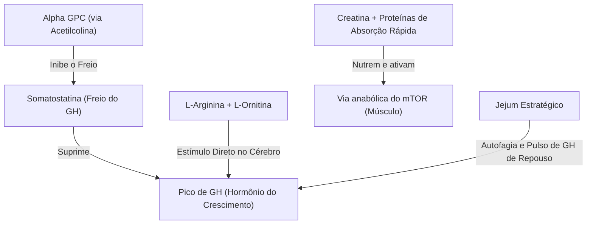

<!-- MÓDULO: 29_04 | Função: Stacks 3 e 4 - Libido/Dopamina & GH/Treino -->
<!-- ANTES: stack hormonal no módulo 29_03 -->
<!-- DEPOIS: stacks de tecido e detox no módulo 29_05 -->
<!-- COBERTURA: 29.3 Stack de libido e dopamina, 29.4 Stack GH/treino -->

### Stack 3: Libido e Dopamina (A neuroquímica do desejo)

O desejo não é apenas um fenômeno hormonal testicular; ele começa como um evento dopaminérgico no cérebro. A testosterona atua regulando a densidade de receptores no cérebro, mas a dopamina é a moeda do foco, da busca, da conquista e do desejo. Se o sistema dopaminérgico estiver sobrecarregado — por exemplo, pelo sequestro digital discutido no Capítulo 8 —, a libido desaparece.

O stack de libido foca em apoiar os níveis de dopamina, regular a prolactina e acalmar o sistema simpático.

- **Maca Peruana (Maca)**: Um fitoterápico adaptógeno com dados clínicos que mostram melhora subjetiva do desejo e da função erétil leve em semanas, sem alterar os níveis de testosterona ou estradiol no sangue. Ela atua modulando a resposta ao estresse e possivelmente vias ligadas a endocanabinoides.
- **Mucuna Pruriens (padronizada em L-DOPA)**: A Mucuna entrega o precursor direto da dopamina (L-DOPA). A dopamina tem uma relação inversa com a prolactina — o hormônio que sobe após o orgasmo e sinaliza saciedade e letargia. Ao apoiar a dopamina, a Mucuna ajuda a modular a prolactina, auxiliando no desejo contínuo.
- **Ginseng e Catuaba/Marapuama**: Compostos que auxiliam no tônus dopaminérgico geral e na estimulação periférica leve do sistema nervoso central.
- **Missão e Propósito (Cap. 10)**: O maior ativador de dopamina saudável é a ação direcionada. Nenhum composto substitui a clareza de direção na vida de um homem.

---

### Stack 4: GH e Treino (Performance e Sinal Anabólico)

O hormônio do crescimento (GH) é o agente de regeneração celular profunda, queima de gordura e integridade de tecidos. O GH é suprimido na circulação por uma molécula chamada somatostatina — o freio biológico do crescimento. 

O objetivo do stack de GH e treino é "soltar o freio" da somatostatina e maximizar o sinal de reconstrução pós-esforço (mTOR).

- **Alpha GPC (L-alfa-gliceofosfocolina)**: Um doador de colina altamente biodisponível que cruza a barreira hematoencefálica e eleva a acetilcolina. A acetilcolina atua no cérebro inibindo temporariamente a somatostatina. Sem a somatostatina ativa, a liberação de GH em resposta ao treino de força é significativamente maior.
- **L-Arginina + L-Ornitina**: A combinação oral clássica estudada por Isidori et al. em 1981 mostrou que a administração combinada de 1,2 g de arginina com 1,2 g de ornitina elevou significativamente os picos de GH sérico em homens jovens saudáveis [175].
- **Creatina Monohidratada**: Satura a fosfocreatina intracelular, fornecendo energia rápida para a contração muscular severa e ativando a captação de água na célula (o que estimula vias de síntese proteica).

---

### Protocolo de Uso e Dosagem

> **Transição:** Stacks de performance e dopamina exigem o uso inteligente do tempo e do estômago para evitar competição de absorção.

#### A base (Stacks Libido & GH)
- **Maca Peruana (Gelatinizada)**: 1,5 g a 3 g por dia, misturada a líquidos ou em cápsulas, pela manhã.
- **Creatina Monohidratada**: 5 g por dia, consumidos de forma contínua em qualquer horário (a consistência da saturação muscular é o que importa).
- **Alpha GPC**: 300 mg a 600 mg, consumidos de 60 a 90 minutos antes do treino de força.
- **L-Arginina + L-Ornitina**: 1,5 g de L-arginina + 1,5 g de L-ornitina antes de deitar ou antes do treino em jejum.

#### Ferramentas situadas (Stacks Libido & GH)
- **Mucuna Pruriens (padronizada em 15–20% de L-DOPA)**: 200 mg a 400 mg por dia, pela manhã. **Aviso**: Evite usar de forma contínua por mais de 4 semanas (recomenda-se ciclar: 5 dias de uso por 2 de pausa).
- **Extrato de Catuaba + Marapuama**: 200 mg a 400 mg em jejum pela manhã.

> [!CAUTION]
> **ALERTA DE SEGURANÇA**: A Mucuna Pruriens contém L-DOPA ativa. Homens que usam medicamentos psiquiátricos, moduladores de dopamina ou inibidores de MAO nunca devem usar Mucuna sem supervisão médica rigorosa, sob risco de crises de hipertensão arterial ou alterações mentais graves. O Alpha GPC pode elevar a acetilcolina de forma aguda; se você perceber leve dor de cabeça, desânimo ou névoa mental após o uso, reduza a dose ou suspenda.
