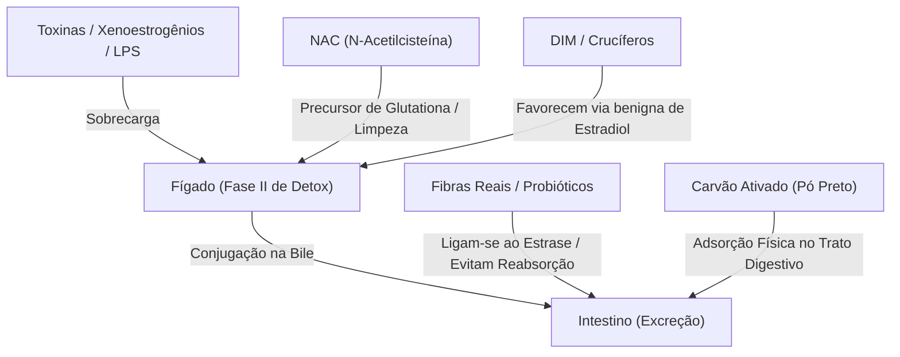

<!-- MÓDULO: 29_05 | Função: Stacks 5 e 6 - Tecido/Tração & Fígado/Intestino/Detox -->
<!-- ANTES: stacks 3 e 4 no módulo 29_04 -->
<!-- DEPOIS: fecho e conclusão do capítulo no módulo 29_06 -->
<!-- COBERTURA: 29.5 Stack tecido/tração, 29.6 Stack detox/fígado/intestino -->

### Stack 5: Tecido e Estrutura (A sustentação da fáscia)

No Capítulo 16, discutimos a túnica albugínea e a fáscia de Buck — as bainhas de tecido colágeno que revestem e sustentam a estrutura hidráulica masculina. Se as fibras que envolvem o tecido cavernoso perderem a elasticidade ou sofrerem fibrose devido à inflamação crônica, a capacidade de retenção sanguínea diminui, gerando uma falha puramente mecânica na rigidez.

O objetivo do stack de estrutura é fornecer os blocos de construção e os cofatores necessários para a síntese saudável de colágeno tipo I e elastina.

- **Colágeno Hidrolisado (Tipo I)**: Entrega altas concentrações de glicina, prolina e hidroxiprolina. Esses aminoácidos são os tijolos específicos que o corpo usa para tecer a tripla hélice que dá força de tração e resistência ao tecido conjuntivo.
- **Vitamina C**: Indispensável na fase de montagem. As enzimas responsáveis por estabilizar a tripla hélice do colágeno (prolil e lisil hidroxilases) dependem diretamente da vitamina C. Sem ela, o corpo produz um colágeno fraco que se desfaz facilmente.
- **MSM (Metilsulfonilmetano)**: Doador de enxofre orgânico. O enxofre é fundamental para a formação de pontes de dissulfeto — as amarras moleculares que mantêm as fibras de colágeno e queratina alinhadas e firmes.

---

### Stack 6: Detox Hepato-Intestinal (A limpeza de estrogênios e endotoxinas)

Como investigado nos Capítulos 13, 24 e 25, a testosterona é constantemente sabotada por dois caminhos: a sobrecarga estrogênica ambiental (xenoestrogênios de plásticos e cosméticos) e as endotoxinas intestinais (LPS) geradas por disbiose. O fígado e o intestino são os filtros encarregados de limpar esse lixo químico.

O stack de detox hepato-intestinal visa apoiar a glutationa e acelerar a excreção intestinal de compostos hormonais indesejados.

- **NAC (N-acetilcisteína)**: Precursor direto da glutationa, o antioxidante mestre do fígado. O fígado usa a glutationa na Fase II de desintoxicação para se ligar a toxinas e estrogênios em excesso, tornando-os hidrossolúveis para que possam ser excretados na bile e na urina.
- **DIM (Diindolilmetano) e Crucíferos**: Compostos de brócolis e couve que auxiliam o fígado a metabolizar o estrogênio pela via da 2-hidroxiestrona (uma via segura e benigna) em vez da via inflamatória da 16-hidroxiestrona.
- **Fibras e Probióticos**: Evitam que o estrogênio excretado na bile seja quebrado pela enzima bacteriana beta-glucuronidase no intestino e reabsorvido de volta ao sangue (via circulação entero-hepática). As fibras se ligam ao estrogênio conjugado e o arrastam para fora do corpo.
- **Carvão Ativado (Pó preto)**: Uma ferramenta de adsorção intestinal mecânica. Ele age como uma esponja física no trato digestivo, ligando-se a microplásticos, pesticidas e endotoxinas (LPS) no intestino antes que eles penetrem na barreira intestinal.

---

### Protocolo de Uso e Dosagem

> **Transição:** Stacks estruturais e hepáticos funcionam melhor quando separados por refeições para maximizar a ação metabólica de cada nutriente.

#### A base (Stacks Tecido & Detox)
- **Colágeno Hidrolisado Tipo I**: 10 g por dia, preferencialmente em jejum pela manhã ou antes de dormir.
- **Vitamina C**: 500 mg a 1.000 mg por dia, tomada junto com o colágeno.
- **MSM**: 1.000 mg a 2.000 mg por dia.
- **NAC (N-acetilcisteína)**: 600 mg por dia, tomada com o estômago vazio (longe de proteínas).
- **Fibras Solúveis (como Psyllium)**: 5 g a 10 g por dia, misturadas em água antes de uma refeição principal.

#### Ferramentas situadas (Stacks Tecido & Detox)
- **DIM (Diindolilmetano)**: 100 mg a 200 mg por dia (caso os exames mostrem excesso de estradiol livre).
- **Carvão Ativado (Pó)**: 1 g a 2 g misturados em água. **Regra estrita de uso**: Tomar apenas em dias de desconforto ou após refeições inflamatórias suspeitas. **Sempre consuma com pelo menos 3 horas de intervalo de qualquer refeição, suplemento ou medicamento.**

> [!CAUTION]
> **ALERTA DE SEGURANÇA HEPATO-INTESTINAL**: O carvão ativado é um adsorvente físico altamente inespecífico. Ele não diferencia microplásticos de nutrientes ou medicamentos essenciais. Se consumido próximo a remédios controlados (pressão, tireoide, antibióticos), ele anulará a eficácia destes fármacos. O uso continuado e incorreto de carvão ativado pode levar a constipação grave e desnutrição. O DIM não deve ser usado se seus exames de estradiol já estiverem na faixa baixa, sob risco de zerar o estrogênio e causar ressecamento articular, letargia e queda de libido.
