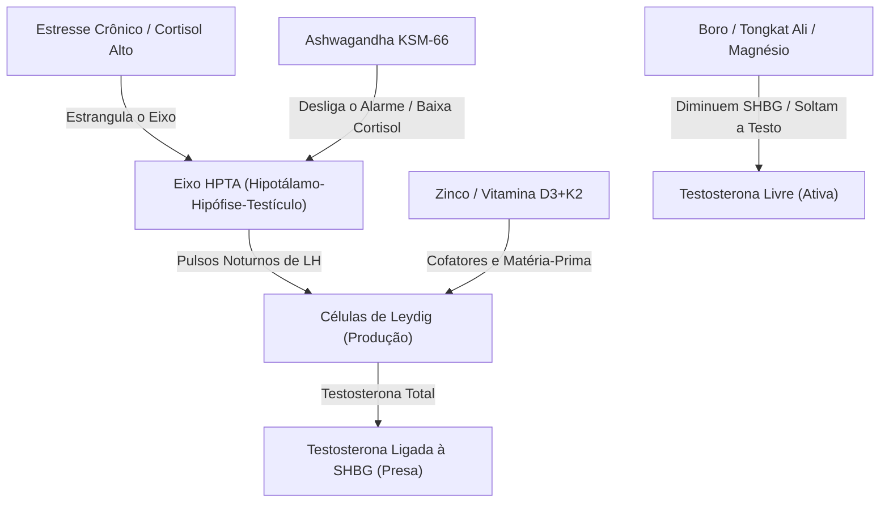
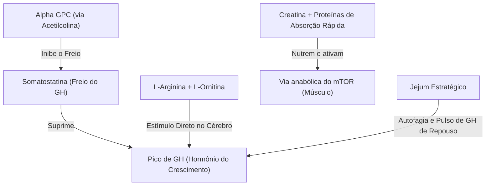
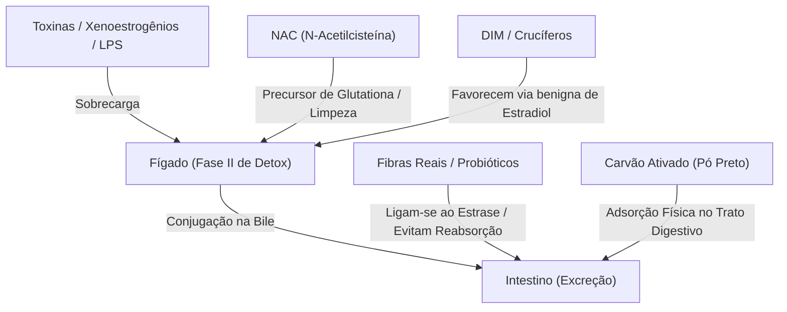

# Capítulo 29 — Stacks por objetivo

> *"O suplemento é a ferramenta, não o combustível. O stack inteligente multiplica o sinal sem sobrecarregar o receptor, mas apenas quando o ambiente diário parou de gritar contra a célula."*

---

Marcos abriu a gaveta do armário da cozinha. Lá dentro, repousavam três potes plásticos de suplementos que ele havia comprado em um impulso de cansaço há seis meses. Rótulos pretos com letras neon prometendo "foco absoluto", "virilidade extrema" e "recuperação rápida". Na época, ele engolia as cápsulas esperando um milagre rápido, mas a única alteração perceptível foi na cor da urina e no extrato bancário. A fadiga continuou lá.

Parado ali hoje, com a casa sem sabotadores e a rotina diária rodando no relógio biológico, Marcos riu do seu eu do passado. Ele entendeu que tentar suplementar um corpo intoxicado por plásticos, privado de sono e bombardeado por luz artificial é o equivalente a colocar gasolina aditivada em um motor fundido. 

A suplementação não substitui a fundação. Ela é o telhado.

Esta seção investiga a mecânica das combinações suplementares inteligentes. No jargão da internet de otimização corporal — o chamado *biohacking* — essas combinações levam o nome de *stacks*. Ao final deste capítulo, você compreenderá como a biologia responde a estímulos combinados de forma multiplicadora — e como montar, com critério, dosagens e precauções, os protocolos específicos para circulação, hormônios, libido, treino e detox.

---

### A ilusão da bala de prata e o sinal da sinergia

O mercado de suplementos prospera vendendo a promessa de um composto único capaz de reverter anos de negligência. A biologia, contudo, não opera em linhas isoladas; ela funciona em redes integradas. Quando você ingere uma megadose de uma única substância para tentar forçar uma via metabólica, o corpo reage. Receptores celulares sofrem uma recalibração para baixo — o mecanismo de autodefesa celular para evitar superestimulação. Em pouco tempo, a mesma dose perde o efeito, e o fígado e os rins recebem a carga de filtrar o excesso.

A alternativa científica é a sinergia: o fenômeno onde a soma de partes pequenas produz um efeito maior do que o esperado. É a matemática biológica do um mais um igual a três. 

Em vez de martelar um único receptor com uma dose massiva de uma planta, o objetivo de um *stack* inteligente é atuar em pontos diferentes de um mesmo sistema biológico usando doses moderadas e seguras de compostos complementares.

Imagine uma cadeia de montagem em uma fábrica. Se você colocar dez trabalhadores na primeira mesa e deixar as mesas seguintes vazias, a produção trava. Um *stack* distribui um trabalhador em cada etapa do processo. Na otimização vascular, por exemplo, isso significa entregar o aminoácido que serve de matéria-prima, a enzima que acelera a reação e o antioxidante que protege o produto final. Cada molécula atua em uma etapa específica, multiplicando o sinal sem sobrecarregar a célula.

Mas antes de olhar para a lista de compostos, a regra de ouro do homem soberano permanece inalterada: o protocolo diário do Capítulo 28 é o piso inegociável. Os stacks abaixo servem para construir sobre uma base limpa. Sem a base, eles são apenas poeira cara.

---

### Stack 1: Circulação e Ereção (A via do Óxido Nítrico)

Marcos aprendeu no Capítulo 14 que o pênis é um barômetro vascular. A ereção é um evento essencialmente hidráulico que depende da integridade do endotélio — a parede interna dos vasos sanguíneos — para produzir o gás vasodilatador, o óxido nítrico (NO). Se o endotélio estiver inflamado ou rígido, o sinal químico falha. 

O stack vascular trabalha em três frentes complementares: substrato, ativação enzimática e proteção antioxidante.

```mermaid
graph TD
    A["L-Citrulina / L-Arginina / Nitratos de Beterraba"] -->|Matéria-prima / Substrato| B["Produção de Óxido Nítrico (NO)"]
    C["Pycnogenol"] -->|Ativação da Enzima eNOS| B
    D["Polifenóis de Romã / OPC de Semente de Uva"] -->|Escudo contra Radicais Livres (Superóxido)| B
    B -->|Vasodilatação Periférica| E["Relaxamento do Tecido Cavernoso / Ereção"]
    F["Ginseng Vermelho Coreano"] -->|Ação Central (Dopamina/Libido)| E
```

#### 1. A Matéria-prima (Substratos)
- **L-Citrulina**: Diferente da L-arginina oral, que sofre destruição massiva no primeiro passo pelo fígado, a citrulina é absorvida de forma eficiente e convertida em arginina nos rins. Ela serve como o fornecimento constante de matéria-prima para a fábrica vascular.
- **Nitratos de Beterraba**: Entram por uma via alternativa. Ao mastigar ou ingerir concentrado de beterraba, bactérias na saliva convertem nitrato em nitrito, que é transformado em óxido nítrico direto no estômago ácido, contornando a via enzimática clássica.

#### 2. A Vela de Ignição (Ativação)
- **Pycnogenol (Extrato de casca de pinheiro marítimo francês)**: Não basta ter matéria-prima se a máquina estiver desligada. O Pycnogenol estimula a expressão da eNOS (a enzima que fabrica óxido nítrico). Um ensaio clínico célebre mostrou que a associação de L-arginina (3 g) com Pycnogenol (120 mg) foi capaz de restaurar a função erétil normal em 92,5% dos homens com disfunção erétil leve após 3 meses de uso [173].

#### 3. O Escudo (Proteção)
- **Polifenóis de Romã e OPC (Semente de Uva)**: O óxido nítrico é uma molécula altamente instável com vida útil de poucos segundos. Se o ambiente celular estiver carregado de estresse oxidativo (radicais livres como o superóxido), o NO é destruído antes de atingir o músculo liso dos vasos. Os polifenóis da romã e os compostos protetores da semente de uva — chamados de OPC, abreviação de oligômeros procianidólicos — atuam como um escudo, varrendo os radicais livres e estendendo a vida útil do óxido nítrico.
- **Ginseng Vermelho Coreano**: Dá suporte na via central, melhorando a liberação de dopamina e a disposição física geral, além de apoiar diretamente a vasodilatação por vias periféricas.

#### Protocolo de Uso e Dosagem

> **Transição:** O stack vascular exige precisão de horários para maximizar a absorção e evitar flutuações na pressão arterial.

##### A base (Stack Vascular)
- **L-Citrulina**: 1,5 g a 3 g por dia, divididos em duas doses (uma pela manhã e outra antes do treino ou antes de deitar).
- **Pycnogenol**: 100 mg a 120 mg por dia, junto com uma refeição.
- **Extrato de Romã (padronizado em punicalaginas)**: 250 mg a 500 mg por dia (ou 150 ml de suco natural sem açúcar).
- **OPC (Extrato de Semente de Uva, padronizado em 95% de polifenóis)**: 150 mg a 300 mg por dia.

##### Ferramentas situadas (Stack Vascular)
- **Ginseng Vermelho Coreano (extrato padronizado)**: 500 mg a 1.000 mg por dia, administrado pela manhã (pode causar leve estimulação).
- **Pó de Beterraba Concentrado**: 5 g a 10 g (misturado em água) 90 minutos antes do treino ou de uma atividade física.

> [!CAUTION]
> **ALERTA DE SEGURANÇA CRÍTICO**: Nunca combine este stack vascular com medicamentos inibidores de PDE5 (como tadalafila/Cialis ou sildenafila/Viagra) sem autorização médica expressa. A combinação de estimuladores de óxido nítrico com bloqueadores de sua degradação pode causar uma queda súbita e perigosa na pressão arterial (hipotensão grave). Homens com histórico de herpes ativo devem usar citrulina/arginina com cautela, pois o excesso desses aminoácidos em relação à lisina pode favorecer a replicação do vírus.

---

### Stack 2: Otimização Hormonal (O suporte ao Eixo HPTA)

Como vimos no Capítulo 11, ter testosterona total alta não adianta se ela estiver presa no sangue pela SHBG — a proteína transportadora que funciona como uma conta bancária bloqueada. Além disso, se o alarme de estresse do corpo (o cortisol) estiver ativado o tempo todo, a ordem militar para os testículos produzirem hormônio simplesmente não chega.

O stack hormonal atua desobstruindo a testosterona livre, modulando o estresse e entregando os cofatores minerais que as células de Leydig precisam para a síntese.



#### 1. Os Desbloqueadores (Redução de SHBG)
- **Boro**: Um mineral de traço subestimado. Um estudo clínico demonstrou que a suplementação de 10 mg de boro livre por 7 dias foi capaz de reduzir o estradiol em 39% e elevar a testosterona livre em 28%, devido a uma diminuição significativa nos níveis de SHBG [174].
- **Tongkat Ali (Long Jack)**: Esta raiz do sudeste asiático possui dados sólidos em homens com níveis hormonais abaixo da média. Ela ajuda a liberar a testosterona ligada ao SHBG e apoia a resposta das células de Leydig ao hormônio luteinizante (LH).
- **Magnésio**: Além de atuar no sono, o magnésio compete com a testosterona pelo sítio de ligação do SHBG, ajudando a manter uma fração maior do hormônio livre na circulação.

#### 2. Os Moduladores de Estresse
- **Ashwagandha KSM-66**: O estresse crônico suprime a liberação de GnRH no hipotálamo, interrompendo a cascata hormonal. Ao reduzir o cortisol em até 23% [175], a Ashwagandha reabre o caminho para que o cérebro ordene a produção testicular.
- **Feno-grego**: Ajuda na modulação da testosterona livre e na proteção contra a degradação acelerada dos hormônios por vias enzimáticas periféricas.

#### 3. Os Blocos Estruturais
- **Zinco**: Cofator mineral de centenas de reações no corpo. A sua deficiência crônica sabota a conversão do colesterol em testosterona nas células de Leydig e acelera a aromatase.
- **Vitamina D3 + K2**: A vitamina D3 é na verdade um pré-hormônio seco que atua diretamente nos receptores androgênicos dos tecidos. A K2 — especialmente na forma MK-7, a versão mais ativa e duradoura da vitamina K2 — é o carteiro que garante que a maior absorção de cálcio promovida pela D3 vá para os ossos e dentes, e não para a parede das artérias.

#### Protocolo de Uso e Dosagem

> **Transição:** A otimização hormonal requer ciclos inteligentes para evitar que o corpo se acostume com as plantas estimulantes.

##### A base (Stack Hormonal)
- **Zinco Quelato (ou Picolinato)**: 15 mg a 30 mg por dia, sempre consumido com comida (evita náusea).
- **Magnésio Bisglicinato (ou Glicinato)**: 300 mg a 400 mg por dia, 60 minutos antes de dormir.
- **Boro (Livre)**: 10 mg por dia. **Regra de ciclo**: 2 semanas de uso por 1 semana de descanso (impede rebote estrogênico).
- **Vitamina D3**: 2.000 UI a 5.000 UI por dia, consumida com a refeição mais gordurosa do dia.
- **Vitamina K2 (MK-7)**: 100 mcg por dia (junto com a D3).

##### Ferramentas situadas (Stack Hormonal)
- **Ashwagandha KSM-66 (extrato padronizado)**: 300 mg a 600 mg por dia, administrado à noite (ou dividido entre manhã e noite).
- **Tongkat Ali (extrato de raiz 200:1)**: 200 mg a 400 mg por dia. **Regra de ciclo**: 5 dias de uso por 2 de descanso (ou 8 semanas por 2 de pausa).
- **Extrato de Feno-grego**: 500 mg a 600 mg por dia.

> [!WARNING]
> **ALERTA DE SEGURANÇA**: O uso de estimulantes do eixo HPTA (como Tongkat Ali e feno-grego) deve ser monitorado por exames de sangue periódicos (painel hormonal completo). Se os exames mostrarem testosterona livre dentro da faixa funcional ideal, evite megadoses desnecessárias. Mulheres e homens com condições hormonais ativas de risco (como tumores de próstata ou sensíveis a estrogênio/androgênio) devem evitar este stack sem avaliação médica especializada.

---

### Stack 3: Libido e Dopamina (A neuroquímica do desejo)

O desejo não é apenas um fenômeno hormonal testicular; ele começa como um evento dopaminérgico no cérebro. A testosterona atua regulando a densidade de receptores no cérebro, mas a dopamina é a moeda do foco, da busca, da conquista e do desejo. Se o sistema dopaminérgico estiver sobrecarregado — por exemplo, pelo sequestro digital discutido no Capítulo 8 —, a libido desaparece.

O stack de libido foca em apoiar os níveis de dopamina, regular a prolactina e acalmar o sistema simpático.

- **Maca Peruana (Maca)**: Um fitoterápico adaptógeno com dados clínicos que mostram melhora subjetiva do desejo e da função erétil leve em semanas, sem alterar os níveis de testosterona ou estradiol no sangue. Ela atua modulando a resposta ao estresse e possivelmente vias ligadas a endocanabinoides.
- **Mucuna Pruriens (padronizada em L-DOPA)**: A Mucuna entrega o precursor direto da dopamina (L-DOPA). A dopamina tem uma relação inversa com a prolactina — o hormônio que sobe após o orgasmo e sinaliza saciedade e letargia. Ao apoiar a dopamina, a Mucuna ajuda a modular a prolactina, auxiliando no desejo contínuo.
- **Ginseng e Catuaba/Marapuama**: Compostos que auxiliam no tônus dopaminérgico geral e na estimulação periférica leve do sistema nervoso central.
- **Missão e Propósito (Cap. 10)**: O maior ativador de dopamina saudável é a ação direcionada. Nenhum composto substitui a clareza de direção na vida de um homem.

#### Protocolo de Uso e Dosagem

> **Transição:** O stack de libido funciona melhor quando a base hormonal já está estável. Use-o quando os hormônios estiverem dentro da faixa e a queda de desejo for de origem neurológica — cansaço, stress, estímulo excessivo de tela.

##### A base (Stack Libido)
- **Maca Peruana (Gelatinizada)**: 1,5 g a 3 g por dia pela manhã, em cápsulas ou dissolvida em líquido. Pode levar de 4 a 8 semanas para efeito subjetivo perceptível.
- **Missão e Propósito**: Sem alvo claro na vida, nenhum composto reativa o desejo de forma duradoura. Este é o cofator insubstituível (Cap. 10).

##### Ferramentas situadas (Stack Libido)
- **Mucuna Pruriens (padronizada em 15–20% de L-DOPA)**: 200 mg a 400 mg por dia, pela manhã em jejum. **Regra de ciclo**: Máximo 4 semanas contínuas; ciclar 5 dias de uso por 2 de pausa.
- **Extrato de Catuaba + Marapuama**: 200 mg a 400 mg em jejum pela manhã.

> [!WARNING]
> **ALERTA DE SEGURANÇA**: A Mucuna Pruriens contém L-DOPA ativa. Homens que usam medicamentos psiquiátricos, moduladores de dopamina ou inibidores de MAO nunca devem usar Mucuna sem supervisão médica rigorosa, sob risco de crises de hipertensão arterial ou alterações mentais graves.

---

### Stack 4: GH e Treino (Performance e Sinal Anabólico)

O hormônio do crescimento (GH) é o agente de regeneração celular profunda, queima de gordura e integridade de tecidos. O GH é suprimido na circulação por uma molécula chamada somatostatina — o freio biológico do crescimento. 

O objetivo do stack de GH e treino é "soltar o freio" da somatostatina e maximizar o sinal de reconstrução pós-esforço (mTOR).



- **Alpha GPC (L-alfa-gliceofosfocolina)**: Um doador de colina altamente biodisponível que cruza a barreira hematoencefálica e eleva a acetilcolina. A acetilcolina atua no cérebro inibindo temporariamente a somatostatina. Sem a somatostatina ativa, a liberação de GH em resposta ao treino de força é significativamente maior.
- **L-Arginina + L-Ornitina**: A combinação oral clássica estudada por Isidori et al. em 1981 mostrou que a administração combinada de 1,2 g de arginina com 1,2 g de ornitina elevou significativamente os picos de GH sérico em homens jovens saudáveis [176].
- **Creatina Monohidratada**: Satura a fosfocreatina intracelular, fornecendo energia rápida para a contração muscular severa e ativando a captação de água na célula (o que estimula vias de síntese proteica).

#### Protocolo de Uso e Dosagem

> **Transição:** Stacks de performance e dopamina exigem o uso inteligente do tempo e do estômago para evitar competição de absorção.

##### A base (Stacks Libido & GH)
- **Maca Peruana (Gelatinizada)**: 1,5 g a 3 g por dia, misturada a líquidos ou em cápsulas, pela manhã.
- **Creatina Monohidratada**: 5 g por dia, consumidos de forma contínua em qualquer horário (a consistência da saturação muscular é o que importa).
- **Alpha GPC**: 300 mg a 600 mg, consumidos de 60 a 90 minutos antes do treino de força.
- **L-Arginina + L-Ornitina**: 1,5 g de L-arginina + 1,5 g de L-ornitina antes de deitar ou antes do treino em jejum.

##### Ferramentas situadas (Stacks Libido & GH)
- **Mucuna Pruriens (padronizada em 15–20% de L-DOPA)**: 200 mg a 400 mg por dia, pela manhã. **Aviso**: Evite usar de forma contínua por mais de 4 semanas (recomenda-se ciclar: 5 dias de uso por 2 de pausa).
- **Extrato de Catuaba + Marapuama**: 200 mg a 400 mg em jejum pela manhã.

> [!CAUTION]
> **ALERTA DE SEGURANÇA**: A Mucuna Pruriens contém L-DOPA ativa. Homens que usam medicamentos psiquiátricos, moduladores de dopamina ou inibidores de MAO nunca devem usar Mucuna sem supervisão médica rigorosa, sob risco de crises de hipertensão arterial ou alterações mentais graves. O Alpha GPC pode elevar a acetilcolina de forma aguda; se você perceber leve dor de cabeça, desânimo ou névoa mental após o uso, reduza a dose ou suspenda.

---

### Stack 5: Tecido e Estrutura (A sustentação da fáscia)

No Capítulo 16, discutimos a túnica albugínea e a fáscia de Buck — as bainhas de tecido colágeno que revestem e sustentam a estrutura hidráulica masculina. Se as fibras que envolvem o tecido cavernoso perderem a elasticidade ou sofrerem fibrose devido à inflamação crônica, a capacidade de retenção sanguínea diminui, gerando uma falha puramente mecânica na rigidez.

O objetivo do stack de estrutura é fornecer os blocos de construção e os cofatores necessários para a síntese saudável de colágeno tipo I e elastina.

- **Colágeno Hidrolisado (Tipo I)**: O colágeno é uma proteína estrutural que funciona como o cabo de aço do corpo — uma tripla hélice de fibras que dá força e elasticidade ao tecido conjuntivo. O colágeno hidrolisado entrega os blocos que o corpo usa para montar essa estrutura: glicina, prolina e hidroxiprolina. Para você: o tecido que sustenta a ereção é feito de uma malha dessas fibras. Se faltar matéria-prima, a malha afrouxa.

- **Vitamina C**: As enzimas que montam a tripla hélice do colágeno — as enzimas que estabilizam a estrutura — dependem diretamente da vitamina C para funcionar. Sem ela, o corpo produz um colágeno fraco que se desfaz facilmente. Para você: não adianta tomar colágeno sem vitamina C. Um não funciona sem o outro.

- **MSM (Metilsulfonilmetano)**: O MSM é um doador de enxofre orgânico. O enxofre é o material das amarrações moleculares — as pontes que mantêm as fibras de colágeno alinhadas e firmes. Pense nele como os parafusos que impedem a estrutura de se desmontar sob pressão. Para você: o MSM consolida o que o colágeno constrói.

#### Protocolo de Uso e Dosagem

> **Transição:** O stack de tecido é o mais silencioso. Os resultados aparecem em meses, não em semanas — porque reconstruir colágeno é um processo lento e metódico.

##### A base (Stack Tecido)
- **Colágeno Hidrolisado Tipo I**: 10 g por dia, preferencialmente em jejum pela manhã ou antes de dormir.
- **Vitamina C**: 500 mg a 1.000 mg por dia, tomada junto com o colágeno (indispensável para a síntese).
- **MSM**: 1.000 mg a 2.000 mg por dia.

##### Ferramentas situadas (Stack Tecido)
- Indicado apenas quando há histórico de fibrose ou suspeita de doença de Peyronie (endurecimento e curvatura do tecido — ver Cap. 16). Nesses casos, a investigação médica vem antes de qualquer suplemento. O stack de base acima é o suporte preventivo e de manutenção para todos os homens.

---

### Stack 6: Detox Hepato-Intestinal (A limpeza de estrogênios e endotoxinas)

Como investigado nos Capítulos 13, 24 e 25, a testosterona é constantemente sabotada por dois caminhos: a sobrecarga de estrogênios vindos de fora do corpo — as moléculas que imitam o hormônio feminino, encontradas em plásticos e cosméticos, chamadas de xenoestrogênios — e as endotoxinas intestinais (LPS) geradas pelo desequilíbrio da flora intestinal, a chamada disbiose. O fígado e o intestino são os filtros encarregados de limpar esse lixo químico.

O stack de detox hepato-intestinal visa apoiar a glutationa e acelerar a excreção intestinal de compostos hormonais indesejados.



O diagrama acima mostra o caminho: o fígado recebe as toxinas, etiqueta-as para descarte, e o intestino as expulsa. Cada composto abaixo atua em um ponto diferente dessa cadeia.

- **NAC (N-acetilcisteína)**: O fígado tem um antioxidante mestre chamado glutationa — o extintor de incêndio interno. Quando o estoque de glutationa cai, as toxinas e os estrogênios acumulam. A NAC é o precursor direto da glutationa: o corpo usa a cisteína da NAC para fabricar mais extintor. O processo em que o fígado gruda um marcador químico nas toxinas para torná-las expulsáveis chama-se Fase II de desintoxicação — o mesmo que vimos no Capítulo 25. Para você: a NAC é o reabastecimento do extintor do fígado.

- **DIM (Diindolilmetano) e Crucíferos**: Compostos do brócolis e da couve que funcionam como um interruptor de direção dentro do fígado. O estrogênio pode ser processado por dois caminhos: uma versão mais segura e uma versão inflamatória. Tecnicamente, chamam-se 2-hidroxiestrona (a mais benigna) e 16-hidroxiestrona (a mais inflamatória). O DIM empurra o metabolismo para o caminho seguro. Para você: menos estrogênio inflamatório circulando, mais equilíbrio hormonal.

- **Fibras e Probióticos**: Após o fígado etiquetar o estrogênio para descarte, ele o envia ao intestino pela bile. Mas há um problema: certas bactérias intestinais produzem uma enzima — a beta-glucuronidase, descrita no Capítulo 24 como a «tesoura» bacteriana que corta a etiqueta de lixo — que remove a marcação e permite que o estrogênio seja reabsorvido de volta ao sangue. As fibras solúveis se ligam fisicamente ao estrogênio marcado antes que a tesoura bacteriana chegue, arrastando-o para fora do corpo. O mecanismo de reabsorção que as fibras interrompem chama-se circulação entero-hepática — o mesmo ciclo do Capítulo 24 onde o corpo reabsorve o que já tinha descartado. Para você: as fibras são a última barreira que impede que o lixo hormonal retorne.

- **Carvão Ativado (Pó preto)**: Uma esponja física que gruda em microplásticos, pesticidas e endotoxinas (LPS) dentro do intestino antes que penetrem na barreira intestinal. Ele não distingue tóxico de nutriente — por isso só se usa em situações pontuais.

#### Protocolo de Uso e Dosagem

> **Transição:** O stack de detox hepático funciona melhor com constância diária nas ferramentas de base. As ferramentas situadas são de uso pontual — não rotina.

##### A base (Stack Detox)
- **NAC (N-acetilcisteína)**: 600 mg por dia, tomada com o estômago vazio (longe de proteínas).
- **Fibras Solúveis (como Psyllium)**: 5 g a 10 g por dia, misturadas em água antes de uma refeição principal.

##### Ferramentas situadas (Stack Detox)
- **DIM (Diindolilmetano)**: 100 mg a 200 mg por dia (apenas quando exames confirmam excesso de estradiol livre).
- **Carvão Ativado (Pó)**: 1 g a 2 g misturados em água. **Regra estrita de uso**: Tomar apenas em dias de desconforto ou após refeições inflamatórias suspeitas. **Sempre consuma com pelo menos 3 horas de intervalo de qualquer refeição, suplemento ou medicamento.**

> [!CAUTION]
> **ALERTA DE SEGURANÇA HEPATO-INTESTINAL**: O carvão ativado é um adsorvente físico altamente inespecífico. Ele não diferencia microplásticos de nutrientes ou medicamentos essenciais. Se consumido próximo a remédios controlados (pressão, tireoide, antibióticos), ele anulará a eficácia destes fármacos. O uso continuado e incorreto de carvão ativado pode levar a constipação grave e desnutrição. O DIM não deve ser usado se seus exames de estradiol já estiverem na faixa baixa, sob risco de zerar o estrogênio e causar ressecamento articular, letargia e queda de libido.

---

### Síntese do mecanismo (Camada 1)

> **Aforismo mnemônico:** O suplemento é a ferramenta, não o combustível. O stack inteligente multiplica o sinal sem sobrecarregar o receptor, mas apenas quando o ambiente diário parou de gritar contra a célula.

### Extensão ao leitor (Camada 2)

Agora você tem em mãos a arquitetura das combinações específicas. Você compreende como a citrulina e o pycnogenol conversam para abrir os vasos sanguíneos; como o boro e o magnésio liberam a testosterona aprisionada; como o Alpha GPC solta o freio do hormônio do crescimento; e como a cisteína protege o fígado enquanto as fibras limpam o intestino. A sua ação prática não deve ser comprar tudo de uma vez. Escolha um alvo específico de acordo com seus sintomas e exames. Introduza um stack de cada vez, mantenha o protocolo estável por quatro a oito semanas, meça os resultados objetivos no corpo e nos testes laborais, e aprenda a escutar as respostas da sua própria biologia.

### Abertura para o próximo capítulo (Camada 3)

Mas à medida que você assume o controle da sua saúde, surge uma nova vulnerabilidade: a facilidade de ser seduzido por falsas curas, alegações infladas e marketing disfarçado de ciência. O Capítulo 30 fecha a nossa investigação abordando a linha que divide a autonomia do homem soberano do perigo da imprudência. Vamos analisar a diferença entre denúncias legítimas e provas científicas reais, como interpretar ensaios em animais sem cometer erros de interpretação humana e quando o rigor exige dar um passo atrás e procurar o suporte de um médico especialista. Para que você nunca seja refém nem das conveniências do sistema tradicional, nem das promessas do guru de internet.

---

## Referências

[173] Stanislavov R, Nikolova V. Treatment of erectile dysfunction with Pycnogenol and L-arginine. *J Sex Marital Ther*. 2003;29(3):207-213. doi:10.1080/00926230390155104

[174] Naghii MR, Mofid M, Asgari AR, et al. Comparative effects of daily and weekly boron supplementation on plasma steroid hormones and proinflammatory cytokines in healthy male volunteers. *J Trace Elem Med Biol*. 2011;25(1):54-58. doi:10.1016/j.jtemb.2010.10.001

[175] Chandrasekhar K, Kapoor J, Anishetty S. A prospective, randomized double-blind, placebo-controlled study of safety and efficacy of a high-concentration full-spectrum extract of ashwagandha root in reducing stress and anxiety in adults. *Indian J Psychol Med*. 2012;34(3):254-262. doi:10.4103/0253-7176.106022

[176] Isidori A, Lo Monaco A, Cappa M. A study of growth hormone release in man after oral administration of amino acids. *Curr Med Res Opin*. 1981;7(7):475-481. doi:10.1185/03007998109114227
